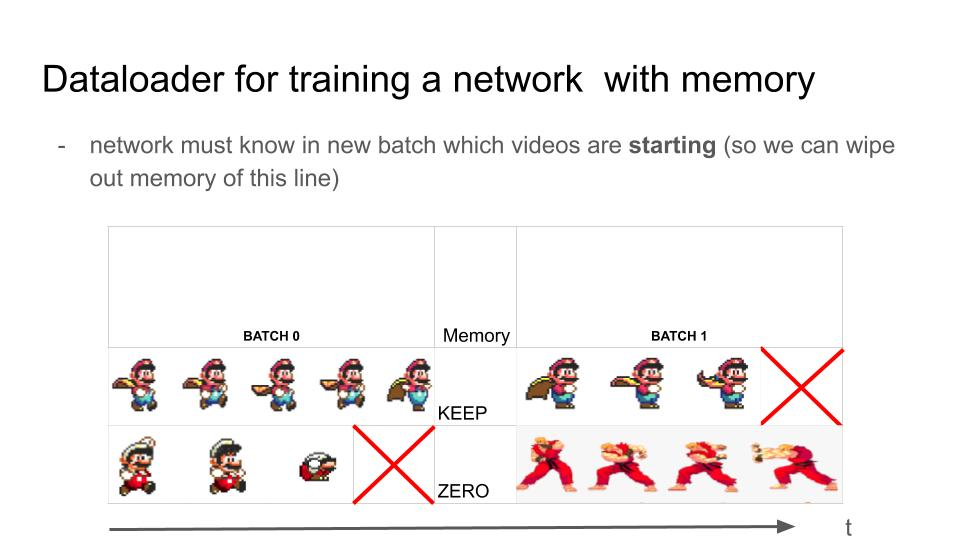

# pytorch-stream-dataloader

**The dataloader to stream videos or text or anything in temporally coherent batches for RNNs/ networks with memory.**

# What is it?

With current implementation of iterable dataset I don't manage to stream several videos / text / audio in temporally coherent batches * with several workers*.
Here i provide a simple implementation of streaming with multiprocessing and pytorch.
This is mainly to get feedback and understand how to do this better / simpler, but if you find this useful don't hesitate to give me feedback as well.

EDIT 21-06-2020: i now manage to make the same thing with the pytorch iterable dataset, following https: // medium.com/speechmatics/how-to-build-a-streaming-dataloader-with-pytorch-a66dd891d9dd

EDIT 21-06-2021: i now use iterable a bit differently, i ask every IterableDataset to retrieve the worker's id, this way I can actually concatenate data using FIFOs. For video reading however, perhaps the most efficient remains the VideoLoader from: https: // github.com/dmlc/decord
The problem is that you cannot really change what is done inside, so you have to load labels / or doing extra work once you receive the data.

With Pytorch Iterable Dataset that returns the worker's id, you can also avoid re-concatenating all the data & simply have different RNNs indexed by the worker's id. This way you do not even need the StreamDataLoader's logic, only the StreamDataset class (and write your own iterator).

Example:

```
class MyMagnificoIterable(IterableDataset):
    ...
    def __iter__(self):
        ...

        worker = torch.utils.data.get_worker_info()
        worker_id = int(worker.id) if worker is not None else 0
        yield my_data, worker_id
...
ds = MyMagnificoIterable(files)  # make sure this yields the data AND the worker's id.

dataloader = torch.utils.DataLoader(ds, batch_size=None, num_workers=whatever)
for batch, worker_id in dataloader:
    the_good_rnn = my_rnns[worker_id]
    y = the_good_rnn(batch)
    ...
```

# Schematic to understand DataLoading for RNN:



# Text Example

A very simple example can be found in examples/demo_text.py together with examples/text_stream_dataset.py

```
TEXTS = [
    "".join([chr(j)+'_'+str(i)+";" for i in range(1000)])
    for j in range(97, 97+27)
]
dataset = make_text_dataset(TEXTS)
for j, batch in enumerate(dataset):
    print('batch'+str(j)+': ')
    for i in range(len(batch)):
        x = "".join([chr(item) for item in batch[i]])
        print(x)
```

#  How to make continuous streaming of text?

Here an example of the text stream
```
class TextStream(object):
    def __init__(self, text, tbins):
        self.text = np.fromstring(text, dtype=np.uint8)
        self.iter = 0
        self.tbins = tbins

    def __len__(self):
        return 100

    def __next__(self):
        if self.iter >= len(self.text):
            return None
        frame = self.text[self.iter:self.iter+self.tbins]
        self.iter += self.tbins
        return frame

    def reload(self, text):
        self.text = text
```
That's it! You just have to create your own iterator, that can be constructed
Here is how you would give this class to the StreamDataset:

```
def make_text_dataset(
    words,
    num_iter=10,
    num_tbins=80,
    num_workers=1,
    batchsize=8,
    max_frames=100,
    start_epoch=0,
):
    array_dims = (num_tbins, 1)
    iter_fun = partial(
        TextStreams,
        stream_files=words,
        num_batches=num_iter,
        max_frames=max_frames,
        num_tbins=num_tbins,
    )

    dataset = StreamDataset(files, iterator_fun, batch_size, "data", None)
    dataloader = StreamDataLoader(dataset, num_workers, my_collate_fn)

    return dataloader
```

Here we give the dataset to the StreamDataloader, which is a small wrapper around Pytorch's DataLoader. All it does is receive batches from the IterableDataset "StreamDataset" and worker ids and collate them as it receives them from the Pytorch's DataLoader.
This will show:

```
- batch1
a_0;a_1;a_2;
b_0;b_1;b_2;
c_0;c_1;c_2;
d_0;d_1;d_2;
e_0;e_1;e_2;
f_0;f_1;f_2;
g_0;g_1;g_2;
h_0;h_1;h_2;

- batch2
a_3;a_4;a_5;
b_3;b_4;b_5;
c_3;c_4;c_5;
d_3;d_4;d_5;
e_3;e_4;e_5;
f_3;f_4;f_5;
g_3;g_4;g_5;
h_3;h_4;h_5;

- batch3
a_6;a_7;a_8;
b_6;b_7;b_8;
c_6;c_7;c_8;
d_6;d_7;d_8;
e_6;e_7;e_8;
f_6;f_7;f_8;
g_6;g_7;g_8;
h_6;h_7;h_8;
...

```
You notice that every row is a coherent sequence(marked by the letter and timestep number for sake of example).
And that this continuity extends accross batches.


# Video Example:

You can run the example/video_dataset.py on any folder containing .mp4!
This should show you a grid of several videos being read at the same time and delivered with "minimal" latency to pytorch GPU. (well that is the idea at least). This indicates a timing around 1 ms to deliver a batch(because the main process is showing the frames and takes time on its own).


